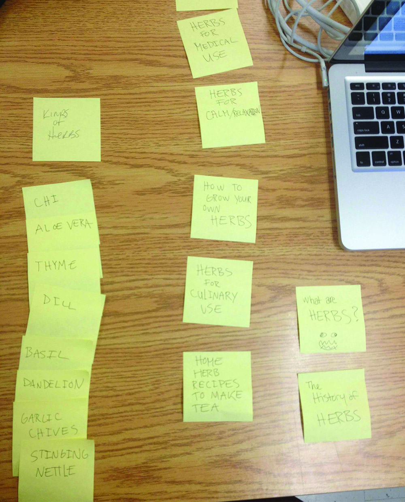
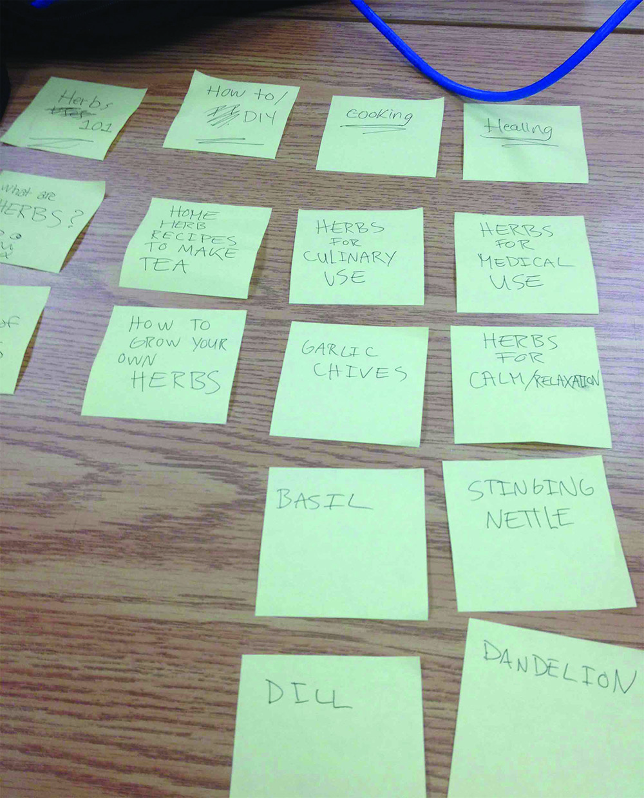

# Card sort report

The purpose of this card sort was to determine common navigation patterns and categories from the content of {your large data-oriented website}.

## Specifics

The card sort was conducted by Celta Riden on Sept/11/2013 between the times of 5 and 6pm with the following participants:

- Sheen Ravary
- Sylvia McCauley

### Cards

12 cards were used covering a broad range of applicable content for the website. The following topics were used as cards:

1. What are herbs?
2. History of herbs
3. Home herb reciepes to make tea
4. Herbs for culinary use
5. Herbs for medical use
6. How to grow your own herbs
7. Garlic Chives
8. Herbs for relaxing
9. Stinging Nettle
10. Dill
11. Dandelion
12. Basil

## Card sort results

*Card sort 1 by Sheena Ravary*

*Card sort 2 by Sylvia McCauley*

## Observations

- Did the participants have any common comments? 
		- Not really
- Did they have questions that stood out? 
		- No
- Did they struggle with certain articles or topics? 
		- No it was pretty straight forward
- Did they find common groupings? Or were the groupings completely different? 
		- Sheena Listed all the types of herbs under *Kinds of herbs* Sylvia divided the types of herbs into two different catagories herbs used for *Cooking* and *Healing*
- Were some of the groupings completely unexpected? 
		- Not really.
- Were the results similar to your expectations? 
		- Pretty much
- How did you feel while watching them perform the task?
		- I didn't really have the chance to watch them as I was doing the same with thier post-its. They didn't take too long so 