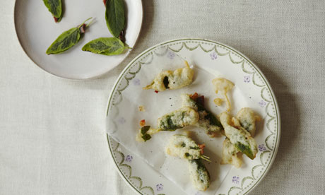

---

title: Anchovy sage fritters 
subtitle: anchovy sage fritters
layout: alt
category: Recipes
Author: Wikipedia
thumb: anchovy-sage-fritters.jpg
description: These small fritters make a great bar snack alongside a cold drink. Alternatively, they can be used with various vegetables, such as courgette and aubergines (or fish), as part of a fritto misto. Whole capers, deep-fried, can be scattered over the final dish.

---

## Anchovy Sage Fritters 

These small fritters make a great bar snack alongside a cold drink. Alternatively, they can be used with various vegetables, such as courgette and aubergines (or fish), as part of a fritto misto. Whole capers, deep-fried, can be scattered over the final dish.

Serves 20

### ingredients

- 150g plain flour, sifted
- 2 tbsp olive oil
- 2 egg whites
- 1 tbsp finely grated parmesan 
- 10 anchovy fillets (in olive oil)
- 40 sage leaves 
- Sunflower oil, for deep frying
- Salt and black pepper

### instructions

1. Add the oil to the plain flour in a large bowl, whisking to combine. Slowly add lukewarm water, whisking, until the batter base is the consistency of double cream. Season with salt and pepper, then set to one side for at least 15 minutes.

2. In another bowl, whisk the egg whites with a pinch of salt until just stiff. Fold into the rested batter along with the parmesan.

3. Cut each anchovy fillet in half. Sandwich between 2 sage leaves to make 20 parcels.

4. Add the oil to a saucepan until it is at least 3cm deep. Heat the oil to around 180C/350F. Have some kitchen roll ready in a tray. Dip the anchovy sage parcels in the batter and fry for a few minutes on each side until golden. This may have to be done in batches, depending on the size of the pan used. Remove with a slotted spoon and drain on kitchen roll. Serve with a wedge of lemon.

Recipe supplied by Jane Baxter

